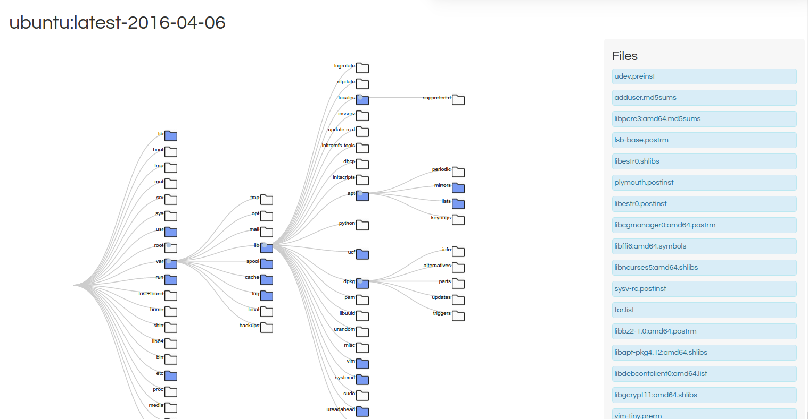
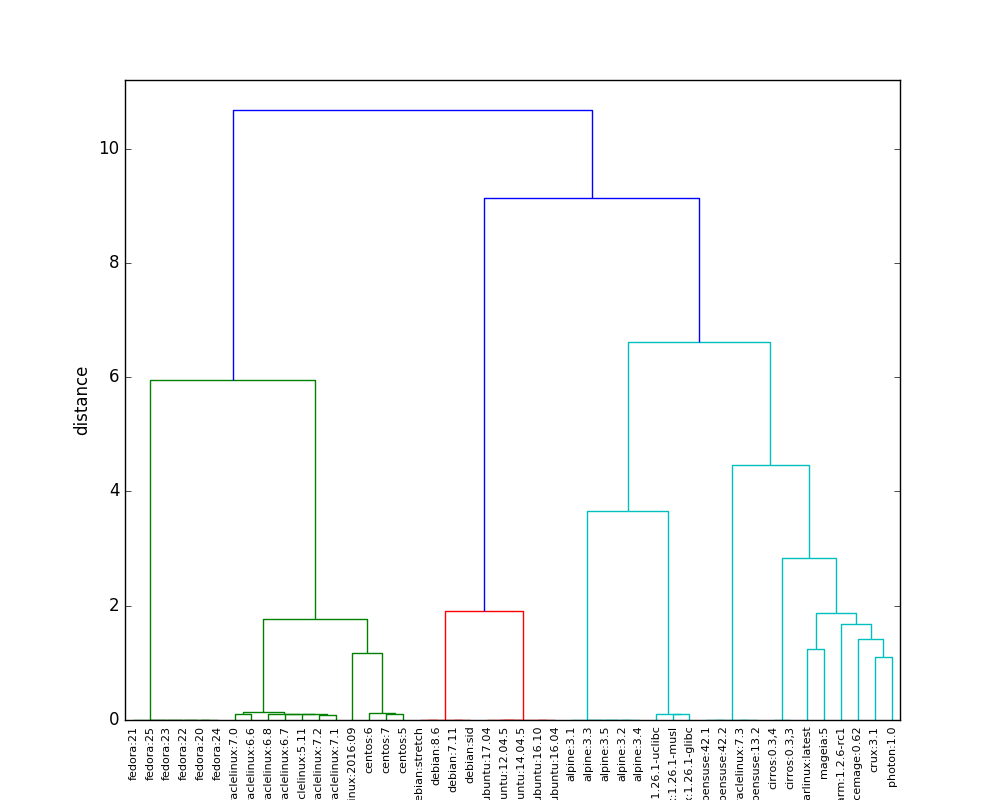
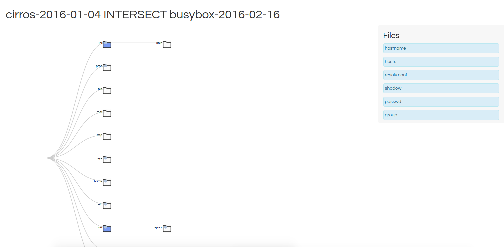
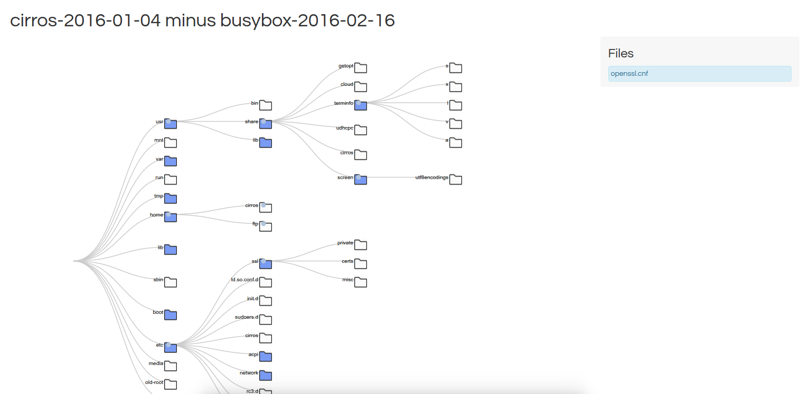
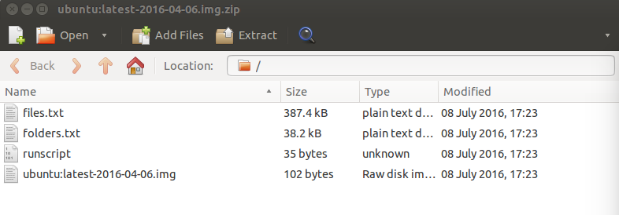

# Singularity Python

This is a python command line tool for working with [Singularity](singularityware.github.io) containers, specifically providing functions to visualize, package, and containers. Currently, most functions use Singularity on the commnd line, and require sudo, and this is expected to change when the software is updated to obtain image folders and files without an export that uses `Singularity export`.

The Singularity-Python code is licensed under the MIT open source license, which is a highly permissive license that places few limits upon reuse. This ensures that the code will be usable by the greatest number of researchers, in both academia and industry. 

## Installation (current)

      pip install singularity

## Installation (dev)

      pip install git+git://github.com/singularityware/singularity-python.git

## Quick Start

Installation will place an executable, `shub` in your bin folder. 

### Test your installation

After installation, you should be able to run `shub` on the command line, without any input args, to see if you have Singularity installed (and test the package):

      $ shub
	Please specify one or more containers with --image(s)

      $  shub --help
	usage: shub [-h] [--image IMAGE] [--images IMAGES] [--debug]
		    [--outfolder OUTFOLDER] [--package] [--os] [--oscalc] [--tags]
		    [--tree] [--simtree] [--subtract] [--simcalc] [--size SIZE]

	Singularity Hub command line tool

	optional arguments:
	  -h, --help            show this help message and exit
	  --image IMAGE         full path to singularity image (for use with --package
		                and --tree)
	  --images IMAGES       images, separated by commas (for use with --simtree
		                and --subtract
	  --debug               use verbose logging to debug.
	  --outfolder OUTFOLDER
		                full path to folder for output, stays in tmp (or pwd)
		                if not specified
	  --package             package a singularity container for singularity hub
	  --os                  estimate the operating system of your container.
	  --oscalc              calculate similarity score for your container vs.
		                docker library OS.
          --osplot              plot similarity scores for your container vs. docker
                                library OS.
	  --tags                retrieve list of software tags for an image, itself
		                minus it's base
	  --tree                view the guts of an singularity image (use --image)
	  --simtree             view common guts between two images (use --images)
	  --subtract            subtract one container image from the second to make a
		                difference tree (use --images first,subtract)
	  --simcalc             calculate similarity (number) between images based on
		                file contents.
	  --size SIZE           If using Docker or shub image, you can change size
		                (default is 1024)

### Classify your container
Singularity python provides functions for quickly assessing the base operating system of your container, retrieving a list of software tags that are relevant when this base is subtracted, and getting similarity scores of your container to a library of base software.

#### Estimate the OS

You can do this on the command line as follows:

      shub --image docker://python:latest --os
      [sudo] password for vanessa
      Most similar OS found to be  debian:7.11
      debian:7.11

or to do this from within Python, see the [provided example](examples/classify_image/estimate_os.py). From within python, you can export the sudopw as the environmental variable "pancakes" and it won't need to ask. This is not ideal, but it's required for now since we are using Singularity to export the image. This will likely be changed soon.

#### Get software tags
Singularity Hub uses a simple algorithm to obtain a likely list of software that is important to your image. It assumes that (most) core installed software is in a folder called `bin`, and returns the list of these files with the estimated base image subtracted. You can do this as follows:

      shub --image docker://python:latest --tags
    

We also provide an [example for Python](examples/classify_image/derive_tags.py). If you do this programatically, you can change the folder(s) that are included, meaning that you could get a custom list of software (eg, libraries in `lib`, or python packages in `site-packages`).

#### Compare to base OS
If you want to get a complete list of scores for your image against a core set of latest [docker-os](singularity/analysis/packages/docker-os) images:

      shub --image docker://python:latest --oscalc

or again see [this example](examples/classify_image/estimate_os.py) for doing this from within python.

You can also generate a [dynamic plot](https://singularityware.github.io/singularity-python/examples/classify_image/) for this data:

      shub --image docker://python:latest --osplot

### View the inside of a container
What's inside that container? Right now, the main way to answer this question is to do some equivalent of ssh. shub provides a command line function for rendering a view to (immediately) show the contents of an image (folders and files) in your web browser. **Important** the browser will open, but you will need to use your password to use Singularity on the command line:

#### Docker Image
shub will render the guts of any Docker image, even if it's not currently on your system. You don't need 

      shub --image docker://ubuntu:latest --tree

#### Singularity Package or Image

      shub --image ubuntu.img --tree

This will open up something that looks like this:

An [interactive demo](https://singularityware.github.io/singularity-python/examples/container_tree) is also available, and see the [example](examples/container_tree) for updates.

### Visualize Containers

#### Container Similarity Clustering
Do you have sets of containers or packages, and want to cluster them based on similarities?

We have examples for both deriving scores and producing plots like the above, see [examples/package_tree](examples/package_tree)

#### Container Similarity Tree

What do two containers have in common, in terms of files and folders? shub provides a command line function for rendering a view to (immediately) show the similarity between to container images:

      shub --images centos.img,ubuntu.img --simtree --debug

      
We can also compare a local image to a Docker image:

      shub --images docker://ubuntu:latest,/home/vanessa/Desktop/ubuntu.img --simtree --debug

Or two Docker images:

      shub --images docker://ubuntu:latest,docker://centos:latest --simtree

If you need output for any of the following, you can add the `--debug` argument. Note that when generating docker comparisons, the back end is obtaining the layers, creating the images, importing and packaging, so the result is not instantanous.

An [interactive demo](https://singularityware.github.io/singularity-python/examples/similar_tree/) is also available.

#### Container Difference Tree
What files and folders differ between two containers? What does it look like if I subtract one image from the second? `shub` provides a command line tool to generate a visualization to do exactly this.

      shub --subtract --images docker://ubuntu:latest,docker://centos:latest

As with `simtree`, this function supports both docker and singularity images as inputs.

An [interactive demo](https://singularityware.github.io/singularity-python/examples/difference_tree/) is also available.

### Compare Containers
The same functions above can be used to show the exact similarities (intersect) and differences (files and/or folders unique to two images) between two images. You can get a data structure with this information as follows:

      from singularity.analysis.compare import compare_containers
  
      image1 = 'ubuntu.img'
      image2 = 'centos.img'
      by = "files.txt" # can also be "folders.txt", or a list with both

      comparison = compare_containers(image1,image2,by=by)

Note that you can also compare packages, or a container to a package:

      def compare_containers(container1=None,container2=None,by=None,
                             image_package1=None,image_package2=None)

#### Calculate similarity of images

We can calculate similarity of images based on the file content inside. For an example, see [examples/calculate_similarity](examples/calculate_similarity). We can compare two local images as follows:

      $ shub --images /home/vanessa/Desktop/ubuntu.img,/home/vanessa/Desktop/ubuntu.img --simcalc
      
and the same applies for specification of Docker images, as in the previous example. Note that we are specifying `images` for the argument instead of `image`, and it's a single string of image names separated by a comma. 

### Package your container
The driver of much of the above is the simple container package. A package is a zipped up file that contains the image, the singularity runscript as `runscript`, a `VERSION` file, and a list of files `files.txt` and folders `folders.txt` in the container. 

The example package can be [downloaded for inspection](http://www.vbmis.com/bmi/project/singularity/package_image/ubuntu:latest-2016-04-06.img.zip), as can the [image used to create it](http://www.vbmis.com/bmi/project/singularity/package_image/ubuntu:latest-2016-04-06.img). This is one of the drivers underlying [singularity hub](http://www.singularity-hub.org) (under development).

  - **files.txt** and **folders.txt**: are simple text file lists with paths in the container, and this choice is currently done to provide the rawest form of the container contents. These files also are used to generate interactive visualizations, and calculate similarity between containers.
  - **VERSION**: is a text file with one line, an md5 hash generated for the image when it was packaged. 
  - **{{image}}.img**: is of course the original singularity container (usually a .img file)

First, go to where you have some images:

      ls
      ubuntu.img
      

You can now use the `shub` command line tool to package your image. Note that you must have [singularity installed](https://singularityware.lbl.gov/install-linux), and depending on the function you use, you will likely need to use sudo. We can use the `--package` argument to package our image:

      shub --image ubuntu.img --package

If no output folder is specified, the resulting image (named in the format `ubuntu.img.zip` will be output in the present working directory. You can also specify an output folder:

      shub --image ubuntu.img --package --outfolder /tmp

For the package command, you will need to put in your password to grant sudo priviledges, as packaging requires using the singularity `export` functionality.

For more details, and a walkthrough with sample data, please see [examples/package_image](examples/package_image)

### Build your container
More information coming soon.

### Functions Provided
You can also use the library as a module, and import singularity-python functions into your application. If you would like to see specific examples for something, [please ask](https://github.com/singularityware/singularity-python)!

## Help and Contribution
Please contribute to the package, or post feedback and questions as [issues](https://github.com/singularityware/singularity-python). For points that require discussion of the larger group, please use the [Singularity List](https://groups.google.com/a/lbl.gov/forum/#!forum/singularity).
